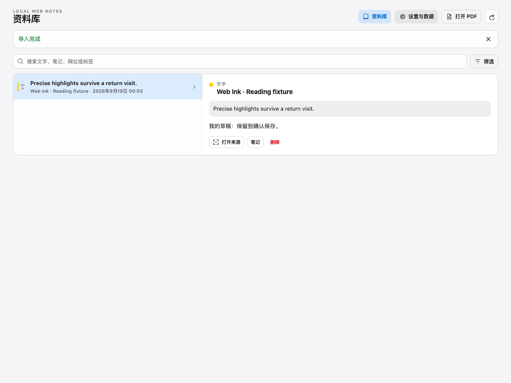
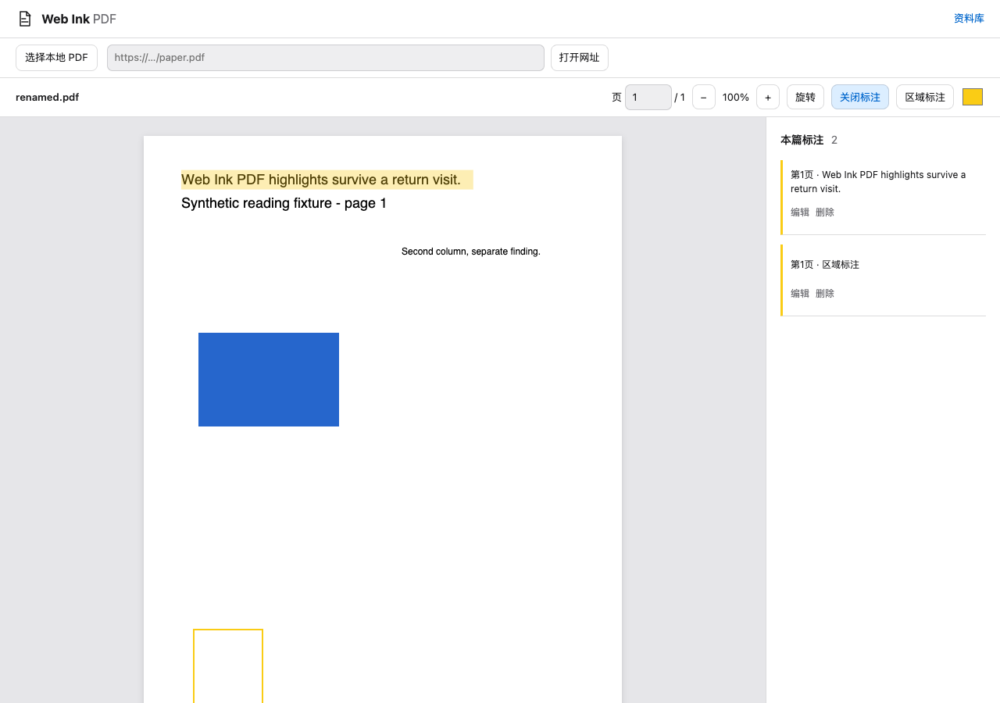

# Web Ink

Web Ink is a local-first Chrome annotation tool for webpage text, image drawings, and PDF text and area annotations. Data stays in the browser profile; there is no account, cloud sync, or telemetry.

[中文](README.md) · [Privacy](PRIVACY.md) · [Third-party notices](THIRD_PARTY_NOTICES.md) · [Release process](docs/RELEASING.md)

> v0.3.0 is a preview. See [validation boundaries](docs/VALIDATION.md) and [performance measurements](docs/PERFORMANCE.md).

## v0.3 improvements

- Selection capture and restoration share a page-local text index. Saving applies a record delta; document mutations invalidate and revalidate anchors.
- Library pages contain at most 50 records. Search retains complete substring matching and cancels superseded work immediately, before debouncing a new query.
- Known-length PDFs fill one destination buffer. Long documents mount only visible and adjacent pages, retaining the reading position as sizes change.
- PDF notes use 50-row batches with Load more. Drafts survive list reordering; file changes require saving or explicitly discarding edits.
- No new runtime dependencies or data migration. IndexedDB remains v3 and portable backups remain schema v2.

## Removing annotations

- On a webpage, click a saved text highlight or image mark and choose **Remove annotation**. Reselecting marked text also shows this action; overlapping records are removed individually.
- In the PDF reader, click a saved highlight or area mark, then choose **Remove annotation**.
- Page/PDF removal can be undone in the current session, preserving the note, tags and color.
- In the library, use **Delete → Confirm delete** within the page; no native modal dialog is required.
- The bottom-right switch only hides/shows annotations; it never deletes them.

## Web annotations

- The 40px bottom-right palette is a per-page switch. When off, Web Ink stays quiet: it does not scan page text, attach page scroll/selection/MutationObserver work, or build a reading index.
- Each canonical URL keeps its own switch. Turning it off hides tools and marks without deleting records. A paused site takes precedence over a page switch.
- When enabled, the webpage engine is injected on demand. Text restore verifies exact text, context, root, and stable container. An ambiguous target remains unresolved rather than being guessed onto similar text.
- The text toolbar starts with recent/current/common colors; More reveals remaining colors and custom input.
- Image selection shows only a hint. Shape, color, undo, redo, and done controls appear after an image is selected. Drawing is rejected for non-identity CSS transforms on an image or ancestor.
- Side panel and library share a macOS-style theme with system/light/dark, reduced-motion, and reduced-transparency preferences.

Ordinary webpage annotation requires Chrome 120 or later. Iframes, page-owned Shadow DOM, browser-internal pages, file URLs, and canvas content are outside this webpage scope.

## PDF

PDF support covers baseline text and area annotations. Coordinates are normalized in the unrotated PDF page coordinate space. The PDF page requires Chrome 125 or later; the minimum version is covered by a dedicated Chrome 125 CI step.

- Open a local file or a specifically authorized HTTPS PDF reader page.
- A single PDF input is limited to **50 MiB**. This protects local rendering and browser memory; it does not mean that the file is stored.
- HTTPS reading uses exact-site authorization and fetches with `credentials: 'omit'`, `cache: 'no-store'`, and `redirect: 'error'`. Redirects are rejected in the MVP: use the final direct PDF URL or download the file and select it locally.
- Only SHA-256, file name, optional source URL, page number, text anchors, and area geometry are stored. **PDF bytes are never stored.**
- To restore a local PDF annotation, select the same-content file again. A changed hash is a different document; Web Ink does not migrate annotations across files.
- No OCR, authenticated-page retrieval, cookie/credential forwarding, or PDF write-back/editing is provided. Encrypted or protected documents may not load.

The renderer uses PDF.js `6.3.289` legacy build with its matching worker and packaged resources. See [third-party notices](THIRD_PARTY_NOTICES.md).

## Storage, backup, and updates

Web/PDF annotations use extension-owned IndexedDB; settings use `chrome.storage.local`. The library filters by keyword, type, color, and tag, and distinguishes logical record size from browser storage estimates.

- Backup schema v2 accepts schema v1 imports. Imports validate before writing, merge by ID, and keep local conflicts unless overwrite is explicitly chosen.
- JSON contains webpage and PDF metadata, never PDF bytes.
- Backup/input capacity is enforced by the UI and validation layer. Treat release-specific UI warnings as authoritative; logical bytes are not physical disk usage.
- Keep one stable unpacked install folder and use **Reload** at `chrome://extensions` for upgrades. The stable public extension ID allows Reload to retain extension-local data; uninstalling deletes it.
- Export JSON before updating, clearing browser data, or changing profiles.

## Development

The Node/npm workflow is unchanged and uses the committed lockfile:

```sh
npm ci
npm run check
npm test
npm run build
npm run test:e2e
npm run zip
```

Reproduce measurements with `npm run benchmark:v03` and `npm run benchmark:pdf`. Both use artificial fixtures and disposable browser profiles. Environment, raw samples, and limitations are in the [performance report](docs/PERFORMANCE.md).

## License

Web Ink is [MIT licensed](LICENSE). Dependency and PDF.js resource notices are in [THIRD_PARTY_NOTICES.md](THIRD_PARTY_NOTICES.md).

## Interface preview




