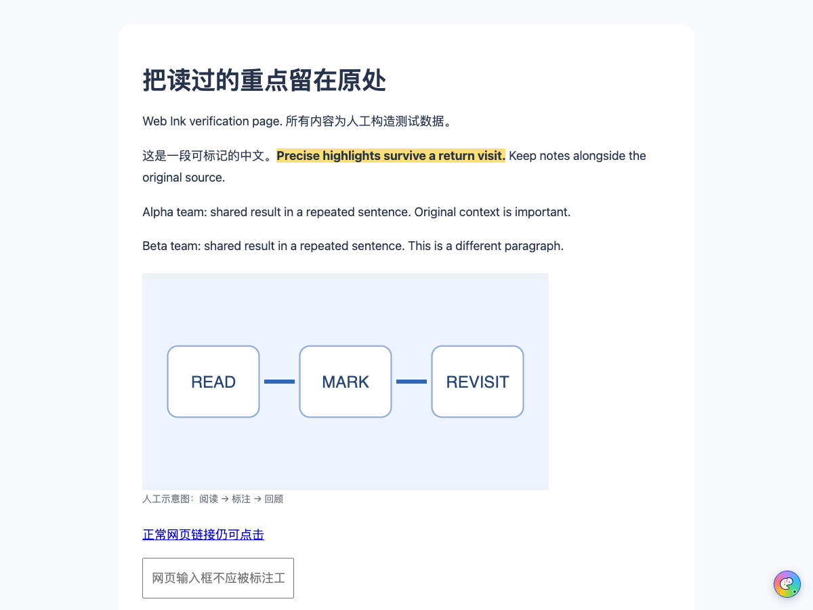
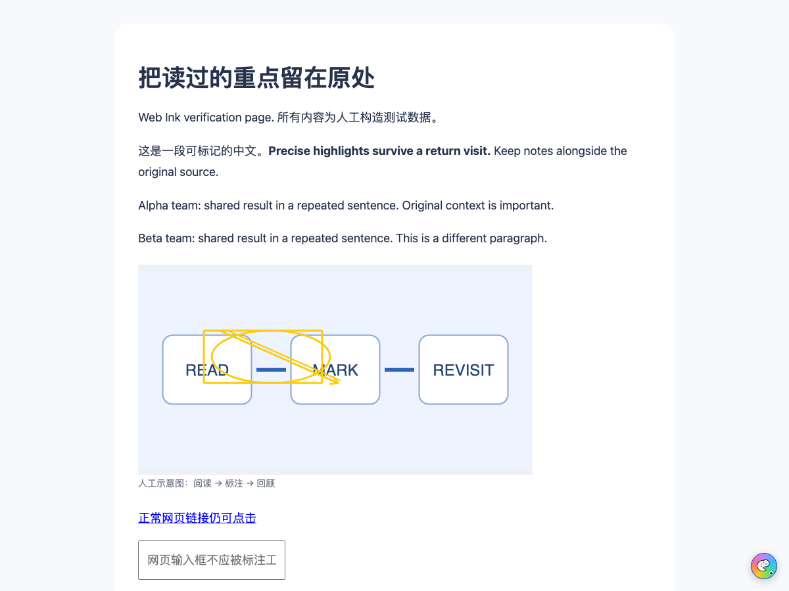

# Web Ink

A quiet-by-default Chrome extension for local text highlights and image annotations. Click the bottom-right palette when you want to annotate, then revisit the page to restore your marks.

[中文](README.md) · [Download v0.1.3](https://github.com/Kinono1/web-ink/releases/tag/v0.1.3) · [CI](https://github.com/Kinono1/web-ink/actions/workflows/ci.yml) · [Privacy](PRIVACY.md)

**v0.1.3 is a prerelease. It supports ordinary webpages; PDF support, cross-device sync and universal dynamic-site compatibility are not available.**



## Install without building

1. Open the [release page](https://github.com/Kinono1/web-ink/releases/tag/v0.1.3) and download **`web-ink-0.1.3-chrome.zip`** under Assets.
2. Extract it into a stable folder, such as `Web-Ink-Chrome`. Its root should contain `manifest.json`.
3. Open `chrome://extensions` in Chrome and enable **Developer mode**.
4. Choose **Load unpacked** and select that folder.
5. Pin Web Ink to the toolbar. Open an ordinary webpage, click the extension icon, choose **Enable page access** in the side panel, and approve Chrome's permission prompt.
6. Refresh the page and click its bottom-right gray palette. The colored palette means annotations are enabled.

This is a manually loaded GitHub distribution, not a Chrome Web Store release. Desktop Chrome 120 or later is required.

## Usage

| Action | How |
| --- | --- |
| Toggle a page | Click the bottom-right palette: gray is off, colored is on |
| Highlight text | Select text and choose a color; a brief notice confirms saving |
| Draw on an image | Choose Draw in the side panel, select an image, then use rectangle, ellipse, arrow or pen; Done or Esc exits |
| Notes, tags and colors | Open Notes on a record in the side panel or library |
| Find records | Open Library and filter by keywords, type, color or tag |
| Pause a website | Choose Pause this site; resume it before enabling a page again |
| Check storage | The local-storage panel distinguishes record size from browser-reported estimates |
| Back up | Backup & import → Download JSON; preview an import before deciding whether to overwrite conflicts |

Each page remembers its own switch. Turning it off hides tools and marks without deleting data. New pages start off; enable older annotated pages once if they have no saved switch preference.



## Data, updates and recovery

Annotations are stored in extension-owned IndexedDB; settings use `chrome.storage.local`. There is no account, cloud sync, telemetry or annotation-upload service.

- Download a JSON backup before updating.
- Replace the files in the same stable install folder with the new ZIP contents, click Reload at `chrome://extensions`, and refresh already-open pages.
- Uninstalling removes extension-local storage. Use Reload when updating.
- Imports merge by ID: identical records are skipped, conflicts keep local data unless overwrite is selected. Local settings and page-switch preferences are retained.
- A single backup is limited to **20 MiB / 50,000 records**. There are early warnings, but split exports are not implemented.
- Markdown is a reading index, not a restorable drawing export. Use JSON for recovery.

Ordinary network images are not separately downloaded. Stored inline image URLs may themselves contain a small image payload; see [PRIVACY.md](PRIVACY.md).

## Known limits

- **PDF is not supported yet**, including Chrome's built-in PDF viewer. Canvas, cross-origin iframes and the page's own Shadow DOM are also outside the current scope.
- Changes to the original text, nearby context, structure or URL can prevent automatic placement. Records remain available; rebind within the same page when needed. Cross-URL migration is not implemented.
- Images use source and structural identity rather than a content fingerprint. Replacing an image at the same URL with another of the same aspect ratio may go undetected.
- Non-identity CSS transforms on an image or ancestor are currently rejected for drawing.
- The library currently reads and renders all records. Pagination, split backups and a PDF reader are future work.

## Development and verification

Use **Node.js 24.15.0** (`.node-version`); Node.js 26 was also used locally. Install from the committed lockfile:

```sh
npm ci
npm run check
npm test
npm run build
npx playwright install chromium
npm run test:e2e
npm run zip
node scripts/checksum.mjs
```

The unpacked build is `.output/chrome-mv3`; release ZIPs are in `.output/`. Verify a checksum from the archive directory:

```sh
cd .output
shasum -a 256 -c web-ink-0.1.3-chrome.zip.sha256
```

Local verification includes **53 unit tests and 11 browser tests**. Browser tests use isolated Chromium profiles; functional-test copies pre-grant hosts and do **not** establish manual native-permission approval. Public-page samples do not establish site-wide compatibility. [Validation record](docs/VALIDATION.md)

The optional `node scripts/real-site-smoke.mjs` checks public Wikipedia, MDN and GitHub pages and is excluded from CI.

## Contributions and release contents

The source repository contains code, tests, the lockfile, documentation, licenses and artificial demo assets. ZIPs and checksums belong in Releases. Dependencies, build output, installed copies, browser profiles, test traces and personal annotation exports are excluded from source control.

[Release process](docs/RELEASING.md) · [Contributing](CONTRIBUTING.md) · [Third-party notices](THIRD_PARTY_NOTICES.md)

[MIT License](LICENSE).
