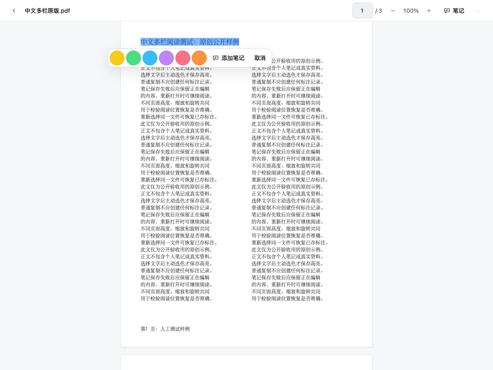

# Web Ink

**Highlight webpages and PDFs, add notes, and draw on images in Chrome. No account. Annotations stay on your device.**

[Download preview](https://github.com/Kinono1/web-ink/releases) · [中文](README.md) · [Usage and limitations](docs/USAGE.en.md) · [Privacy](PRIVACY.md)



## Install

1. Download `web-ink-<version>-chrome.zip` from Releases and extract it into a permanent folder.
2. Open `chrome://extensions`, turn on Developer mode, choose **Load unpacked**, and select the folder containing `manifest.json`.
3. Open a webpage, click Web Ink in Chrome's toolbar, grant page access when prompted, and enable the bottom-right page switch before highlighting text.

Webpages require Chrome 120+, and the PDF reader requires Chrome 125+. This is a preview. Check **Library → Settings & data** for the installed version and build identity; source, development builds, and public archives may differ. Consult the release notes for verified coverage.

## Update without losing notes

1. Export a JSON backup from **Library → Settings & data**.
2. Replace the runtime files in the same install folder with the new archive's files.
3. Click **Reload** on Web Ink's extension card and reopen the side panel. If the browser refuses reinjection into a page, follow the prompt to refresh that page and retry.

**Do not uninstall: uninstalling removes extension-local data.** Keep the same browser profile and install folder. Developer updates run only in the primary checkout. Chrome's loaded target stays `.output/chrome-mv3`; builds go to `.build-output/chrome-mv3`, and receipts and recovery backups live in `.local-install/`. Explicitly enroll a confirmed legacy installation once with `npm run register:local`, then use `npm run update:local`. The updater accepts a clean commit's matching sealed build, backs up and overwrites runtime files individually, hash-checks the result, and rolls back on failure. Linked worktrees are rejected before building or writing. Initial installation remains explicit.

## Read, annotate, return

- Select webpage text and choose a color. Click a saved mark to add a note or remove it; removal can be undone.
- Use the side panel's image tools for rectangles, ellipses, arrows, and freehand drawing.
- Click Web Ink in Chrome's toolbar, then **Start annotating in this tab** in the side panel. The current tab switches to the Web Ink reader. Select text, then choose a color or add a note. **Return to original reader** opens the address observed before the switch. Choose among multiple sources when needed; download authenticated or unavailable files and choose them locally.
- Search the library and export JSON or Markdown. If a webpage changes, unresolved notes are retained and can be rebound.

Data belongs to the current browser profile; there is no cross-device sync. Choose the same local PDF again to restore its notes and reading position. Original PDF bytes are not saved in the library. Reading and floating-button positions are local preferences outside annotation backups. Return sessions may expire after browser restart or extension Reload; the reader then offers the PDF source or file selection. Back up before clearing browser data or changing devices.

## Limits and development

Webpage annotations do not cover iframes, page-owned Shadow DOM, canvas, or browser-internal pages. PDFs are limited to 50 MiB; no OCR, credential forwarding, or PDF write-back is provided. Online PDFs require an authorized direct public HTTPS URL. See [detailed usage](docs/USAGE.en.md).

```sh
npm ci
npm run check
npm test
npm run test:bulk
npm run test:release
npm run build
npm run test:e2e
npm run zip
```

The full browser suite requires two verified baselines: `WEB_INK_OLD_BUILD` is the extracted v0.3.0 release archive, and `WEB_INK_RELOAD_OLD_BUILD` is the v0.3.1 build at commit `d37555855f4d3f8cec0bbd27d28de8afa12f49fc`. CI prepares both. See [release process](docs/RELEASING.md) for local setup; missing baselines fail instead of skipping upgrade acceptance.

Use Node 24.15+ within the package engine range and the committed lockfile. `build` checks entry points, static resource references and prepared PDF assets, then writes `runtime-integrity.json`. Installation and packaging reject missing, modified or unlisted runtime files. Complete legacy installs can still be upgraded. `zip` verifies and packages the existing build without rebuilding. Clean builds use the commit timestamp as their reproducible build epoch.

[Validation](docs/VALIDATION.md) · [Performance evidence](docs/PERFORMANCE.md) · [Release process](docs/RELEASING.md) · [Third-party licenses](THIRD_PARTY_NOTICES.md) · [MIT license](LICENSE)
