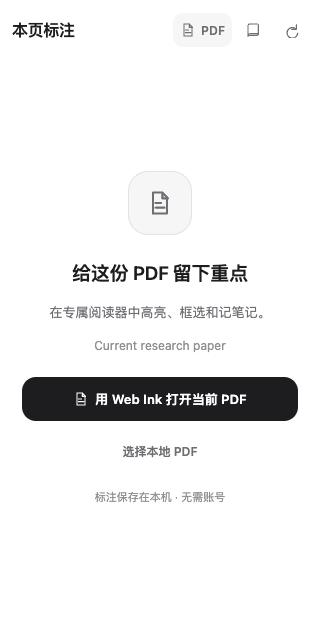

# Web Ink

**在 Chrome 本机为网页和 PDF 划重点、写笔记、圈画图片。无需账号，标注不上传。**

[下载预览版](https://github.com/Kinono1/web-ink/releases) · [English](README.en.md) · [使用说明与支持范围](docs/USAGE.zh-CN.md) · [隐私说明](PRIVACY.md)



## 安装：第一次使用

1. 从 Releases 下载 `web-ink-<版本>-chrome.zip`，解压到一个固定文件夹。
2. 打开 `chrome://extensions`，开启开发者模式，点击 **加载已解压的扩展程序**，选择包含 `manifest.json` 的文件夹。
3. 打开普通网页，点击 Chrome 工具栏的 Web Ink，按提示授权网页访问；点击网页右下角的开关，再选中文字进行高亮。

Chrome 120 起支持网页标注，PDF 阅读器要求 Chrome 125 或更高。当前为预览版；源码、本机开发构建和公开下载包可能不同，请在 **资料库 → 设置与数据** 查看版本与构建标识。每个发布包的实际验收范围见 Release 说明。

## 更新：保留原来的安装目录

1. 在 Web Ink 的 **资料库 → 设置与数据 → 下载 JSON** 备份标注。
2. 解压新版本，用其运行文件替换原安装目录的文件。
3. 在 `chrome://extensions` 找到 Web Ink，点击该扩展的 **重新加载**，刷新原网页并重新打开侧栏。

**不要卸载旧扩展：卸载会删除本地数据。** 保持同一个浏览器 profile 和安装目录；不要把源码目录当作扩展安装目录。

本项目开发者更新已存在的 `Web-Ink-Chrome` 目录，可运行 `npm run update:local`。它会备份旧构建、检查扩展身份、同步并核对全部文件；复制失败会回滚。首次安装仍由上面的步骤明确选择目录。

## 日常使用

- **网页高亮与笔记：** 选中文字后选择颜色；点击已有标注可查看笔记、删除，删除后可撤销。
- **图片圈画：** 从侧栏进入图片绘制，使用矩形、椭圆、箭头或画笔。
- **PDF：** 点击侧栏顶部的 **PDF**。识别到当前文件时，选择 **用 Web Ink 打开当前 PDF**；地址不可读或需要登录时，下载后选择本地文件。不会替换你的默认阅读器。
- **找回与导出：** 资料库可搜索和筛选记录，导出 JSON 备份或 Markdown。网页变动无法定位时，原笔记仍保留，可重新绑定。

数据仅保存在当前浏览器。重新选择原来的本地 PDF 可恢复标注，PDF 原文件不会存入资料库。没有跨设备同步；清理浏览器数据或更换设备前请先导出。

## 支持边界

支持普通网页文字、图片，以及基础 PDF 文字和区域标注。iframe、网页自身 Shadow DOM、canvas、浏览器内部页不属于网页标注范围。PDF 单文件上限 50 MiB；不支持 OCR、凭据转发或修改 PDF 原文件。在线 PDF 必须是已授权、可直接读取的公开 HTTPS 地址；登录、跳转或加密文档请参考[详细说明](docs/USAGE.zh-CN.md)。

## 开发与验证

使用 Node 24.15 或兼容版本及提交的锁文件：

```sh
npm ci
npm run check
npm test
npm run test:bulk
npm run test:release
npm run build
npm run test:e2e
npm run zip
```

`npm run zip` 只归档已构建的运行文件，并验证压缩包内容和 SHA-256，不会再次构建。发布必须来自干净、已验收的提交；构建信息中的时间是可复现构建基准时间。

[验证记录](docs/VALIDATION.md) · [性能及测量边界](docs/PERFORMANCE.md) · [发布流程](docs/RELEASING.md) · [第三方许可](THIRD_PARTY_NOTICES.md)

## 许可

[MIT](LICENSE)。
