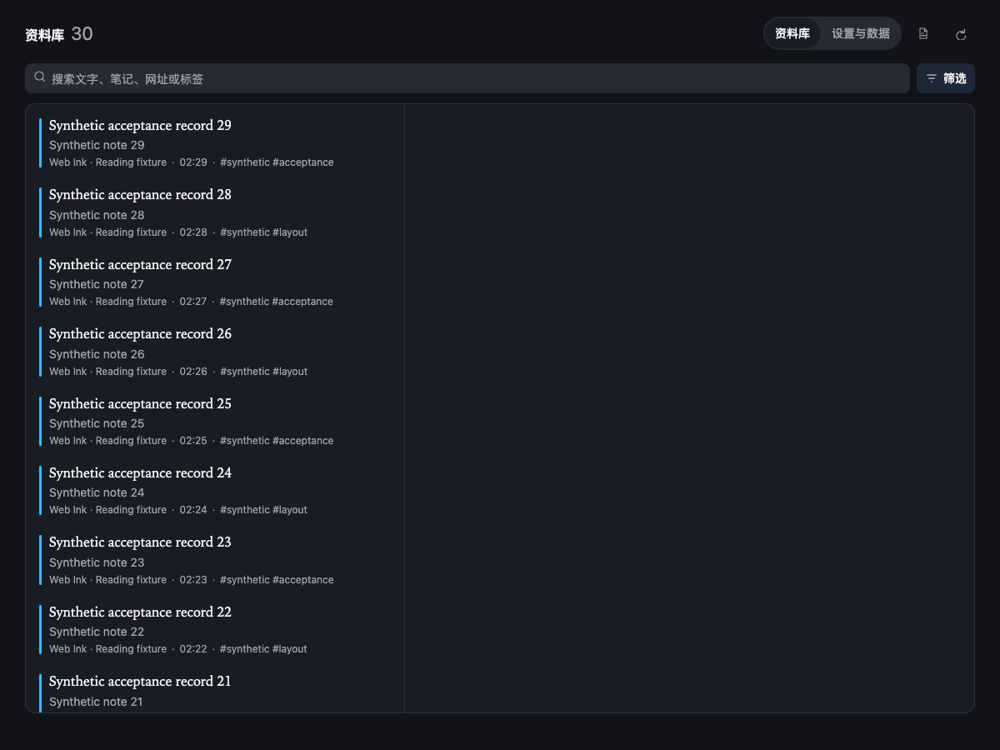
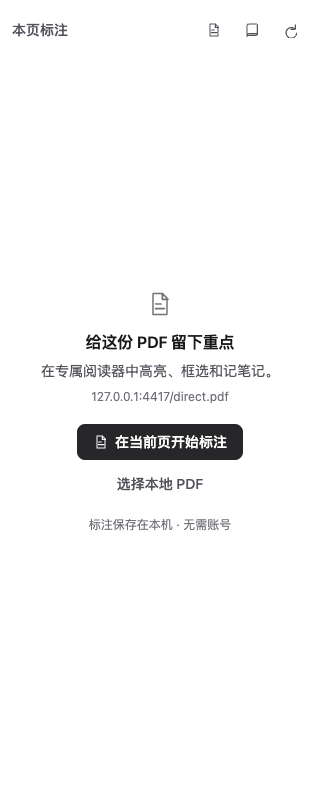

# Web Ink

Web Ink 是本地优先的 Chrome 标注工具：网页文字、图片绘制，以及PDF 文字和区域标注。数据留在浏览器本机；没有账号、云同步或遥测。

[English](../README.en.md) · [隐私说明](../PRIVACY.md) · [第三方许可](../THIRD_PARTY_NOTICES.md) · [发布流程](RELEASING.md)

> 源码候选版本为 v0.3.2，公开下载包可能较早。支持范围与实际测试边界见 [验证记录](VALIDATION.md)，既有性能数据见 [测量报告](PERFORMANCE.md)。

## v0.3 的优化

- 文字选区和恢复共用当前页面的文字索引；保存后更新新增记录，正文变动时重新验证定位。
- 资料库每页最多 50 条，搜索保持完整子串匹配；输入变化立即取消旧任务，再防抖发起新查询。
- 已知长度 PDF 直接填入一个目标缓冲区；长文档只挂载可见页及相邻页，缩放和页面尺寸更新保留阅读位置。
- PDF 标注列表每次显示 50 条，可加载更多；编辑中的笔记跨列表重排保留，换文件前先保存或明确放弃。
- 不新增运行时依赖，数据库仍为 v3、备份仍为 schema v2，无本轮数据迁移。

## 取消标注

- 网页：点击已有文字高亮或图片标记，在浮层选择 **取消标注**；重新选中已高亮文字也会出现该按钮。重叠标注按条选择，不会一次删除其它记录。
- PDF：点击已有高亮或区域标记，选择 **取消标注**。
- 网页和 PDF 取消后可在当前会话中撤销，原笔记、标签和颜色一起恢复。
- 资料库：打开记录，点击 **删除 → 确认删除**；确认在界面内完成，不依赖浏览器弹窗。
- 右下角总开关只控制显示与工具启用，不删除数据。

## 网页标注

- 右下角 40px 调色盘是当前网页的总开关：关闭时保持安静，不扫描正文、不绑定网页滚动/选区/MutationObserver，也不建立文本阅读索引。
- 每个 canonical URL 独立记忆开关；关闭只隐藏网页工具与标记，不删除记录。暂停的网站优先于页面开关。
- 开启后按需注入网页 engine。文字恢复使用 exact text、上下文、根/稳定容器验证；无法唯一确认时保持“未定位”，不猜测性绑定。
- 文字工具条先显示最近颜色、当前颜色和三个常用颜色；“更多”才展开全部颜色与自定义色。
- 图片选取阶段只显示提示；选中后才显示矩形、椭圆、箭头、画笔、颜色、撤销、重做和完成。图片与祖先的非恒等 CSS transform 会被拒绝。
- 侧栏、资料库和阅读器使用统一主题，可选系统/浅色/深色，并支持降低动效和降低透明度。悬浮按钮可以拖动，位置保存在本机；其他已打开网页不随之移动。

普通网页要求 Chrome 120 或更高版本。iframe、网页自身 Shadow DOM、浏览器内部页、file URL 与 canvas 内容不在网页标注范围内。

## PDF

打开 PDF 时，点击 Chrome 工具栏中的 Web Ink 打开侧栏，再选择 **在当前页开始标注**。当前标签页切换到 Web Ink 阅读器，保留 **返回原阅读器**。多个可读来源需要先选择；IEEE 等包装页只使用实际可见的嵌入地址，不猜下载链接。来源未知、本地文件或需要登录的 PDF，可打开手动入口选择文件或粘贴公开链接。此操作不修改默认 PDF 阅读器。

选中文字后，选区附近会出现颜色和笔记工具；选择颜色才保存高亮，普通复制不产生记录。**添加笔记**先保存高亮，再进入笔记编辑。保存失败保留选区或草稿并提供重试；跨页选区需要改为在单页内选择。**显示标注**控制已保存叠层，不妨碍创建新标注。旋转、区域标注、其他文件和资料库位于 **更多**。

使用阅读器内的返回、换文件或资料库入口时，未保存内容会提供 **保存并继续／放弃并继续／继续编辑**；保存失败留在当前文件。关闭或刷新标签页时，有未保存内容才触发浏览器的离开确认。浏览器强制退出或外部扩展 Reload 不能保证内存草稿保留，更新前请先保存。

PDF 支持基础文字标注与区域标注，坐标保存为未旋转页面坐标中的归一化值。PDF 页面需要 Chrome 125 或更高版本；最低版本由专门的 Chrome 125 CI 用例验证。

- 可从本地文件选择 PDF，或从明确授权的 HTTPS PDF 读者页面读取。
- 单个 PDF 输入上限为 **50 MiB**；该限制保护本地渲染和浏览器内存，不表示会存储文件内容。
- HTTPS 读取使用精确站点授权，并以 `credentials: 'omit'`、`cache: 'no-store'`、`redirect: 'error'` 获取。重定向在 MVP 中被拒绝；请使用最终直接 PDF 地址，或下载后选择本地文件。
- 只保存 PDF 的 SHA-256、文件名、可选来源 URL、页码、文字锚点和区域几何；**不保存 PDF bytes**。
- 要恢复本地 PDF 标注和阅读位置，请重新选择原来的 PDF。文件内容变化时，旧标注仍保留，不会自动套用到新文件。
- 页码、页内位置、缩放和旋转按文件内容分别保存；已授权的公开来源刷新后可重新读取。本地文件仍需重选，文件字节不留存。阅读位置不进入 JSON 标注备份。
- 回程会话在浏览器重启或扩展 Reload 后可能失效；有公开来源时显示 **打开 PDF 来源**，本地文件提供重新选择入口。
- 不提供 OCR、认证页面抓取、cookie/凭据转发或写回/修改 PDF 文件。加密或受保护文档可能无法读取。

PDF renderer 使用 PDF.js `6.3.289` legacy build、同版本 worker 和随包资源。详见 [第三方许可](../THIRD_PARTY_NOTICES.md)。

## 存储、备份与升级

网页/PDF 标注保存在扩展拥有的 IndexedDB；设置保存在 `chrome.storage.local`。资料库可按关键词、类型、颜色和标签筛选，并显示逻辑记录大小与浏览器占用估算。

- 备份 schema v2 兼容导入 schema v1；导入前验证，按 ID 合并，冲突默认保留本地记录。
- 网页和 PDF 元数据都进入 JSON 备份；PDF 原始 bytes 从不进入备份。
- 备份与输入容量由界面和验证层限制；以实际发布版本的提示为准，不能把逻辑大小当作物理磁盘占用。
- 升级请保留稳定的解压安装目录，在 `chrome://extensions` 使用 **Reload**，不要卸载。manifest 的稳定 public extension ID 使 Reload 可保留扩展本地存储；卸载会删除本地数据。
- 更新、清理浏览器数据、切换 profile 前先导出 JSON 备份。

## 开发

Node/npm 工作流保持不变，使用提交的 `package-lock.json`：

```sh
npm ci
npm run check
npm test
npm run build
npm run test:e2e
npm run zip
```

性能复现：`npm run benchmark:v03` 与 `npm run benchmark:pdf`。这两组测量使用人工样例和临时浏览器 profile；测量环境、原始样本和限制见 [性能报告](PERFORMANCE.md)。

## 许可

本项目采用 [MIT License](../LICENSE)。依赖与 PDF.js 资源的完整说明见 [THIRD_PARTY_NOTICES.md](../THIRD_PARTY_NOTICES.md)。

## 界面预览






这些截图来自独立测试配置中的人工样例；原生权限、Scholar/IEEE 和本机更新验收仍需单独完成。截图来源与哈希见 [记录](images/v032-provenance.json)。
